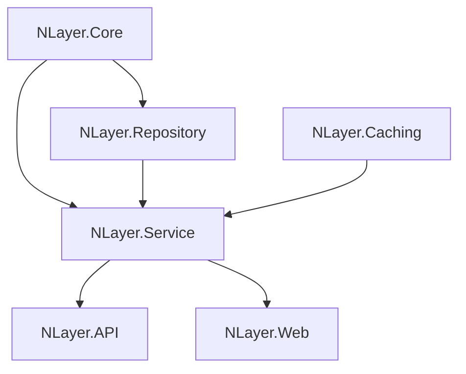

# NLayerApp

N-Layer (Çok Katmanlı) mimari ile geliştirilmiş, modern .NET uygulaması. Clean Architecture prensiplerine uygun olarak tasarlanmış, ölçeklenebilir ve sürdürülebilir bir yapı sunar.

## Proje Katmanları

### 🏗️ **NLayer.Core**
- **Models**: Temel veri modelleri (Product, Category, ProductFeature, BaseEntity)
- **DTOs**: Veri transfer nesneleri
- **Repositories**: Repository arayüzleri
- **Services**: Servis arayüzleri
- **UnitOfWorks**: Unit of Work arayüzleri

### 🗄️ **NLayer.Repository**
- **AppDbContext**: Entity Framework DbContext
- **Repositories**: Repository gerçekleştirimleri
- **UnitOfWorks**: Unit of Work gerçekleştirimleri
- **Configurations**: Entity konfigürasyonları
- **Migrations**: Veritabanı migration dosyaları
- **Seeds**: Başlangıç verileri

### ⚙️ **NLayer.Service**
- **Services**: İş mantığı servisleri
- **Validations**: FluentValidation kuralları
- **Mapping**: AutoMapper konfigürasyonları
- **Exceptions**: Özel exception sınıfları

### 🌐 **NLayer.API**
- **Controllers**: RESTful API controller'ları
- **Filters**: Action ve Exception filter'ları
- **Middlewares**: Özel middleware'ler
- **Modules**: API modülleri

### 🖥️ **NLayer.Web**
- **Controllers**: MVC controller'ları
- **Views**: Razor view'ları
- **Models**: View model'leri
- **Services**: Web servisleri

### ⚡ **NLayer.Caching**
- **ProductServiceWithCaching**: Cache destekli ürün servisi

## Temel Özellikler

- ✅ **Clean Architecture**: Katmanlar arası bağımlılık yönetimi
- ✅ **Entity Framework Core**: Modern ORM kullanımı
- ✅ **Repository Pattern**: Veri erişim soyutlaması
- ✅ **Unit of Work**: Transaction yönetimi
- ✅ **AutoMapper**: Nesne dönüşümleri
- ✅ **FluentValidation**: Veri doğrulama
- ✅ **Caching**: Redis/In-Memory cache desteği
- ✅ **API & Web**: Hem REST API hem de MVC Web arayüzü

## Kurulum

1. **Projeyi klonlayın:**
   ```bash
   git clone https://github.com/SametDulger/NLayerApp.git
   cd NLayerApp
   ```

2. **Veritabanı bağlantısını yapılandırın:**
   - `NLayer.API/appsettings.json` ve `NLayer.Web/appsettings.json` dosyalarında connection string'i güncelleyin

3. **Migration'ları uygulayın:**
   ```bash
   dotnet ef database update --project NLayer.Repository
   ```

4. **Projeyi çalıştırın:**
   ```bash
   # API için
   dotnet run --project NLayer.API
   
   # Web için
   dotnet run --project NLayer.Web
   ```

## Katmanlar Arası Bağımlılıklar



## Proje Yapısı

```
NLayerApp/
├── NLayer.Core/           # Temel modeller ve arayüzler
├── NLayer.Repository/     # Veri erişim katmanı
├── NLayer.Service/        # İş mantığı katmanı
├── NLayer.API/           # RESTful API
├── NLayer.Web/           # MVC Web uygulaması
├── NLayer.Caching/       # Cache katmanı
└── NLayerApp.sln         # Visual Studio çözüm dosyası
```

## Kullanılan Teknolojiler

- **.NET 8**: Modern .NET framework
- **Entity Framework Core**: ORM
- **AutoMapper**: Nesne mapping
- **FluentValidation**: Veri doğrulama
- **ASP.NET Core**: Web framework
- **RESTful API**: Modern API tasarımı
- **MVC Pattern**: Web arayüzü
- **Repository Pattern**: Veri erişim deseni
- **Unit of Work**: Transaction yönetimi

## API Endpoints

### Products
- `GET /api/products` - Tüm ürünleri listele
- `GET /api/products/{id}` - Ürün detayı
- `POST /api/products` - Yeni ürün ekle
- `PUT /api/products/{id}` - Ürün güncelle
- `DELETE /api/products/{id}` - Ürün sil

### Categories
- `GET /api/categories` - Tüm kategorileri listele
- `GET /api/categories/{id}` - Kategori detayı
